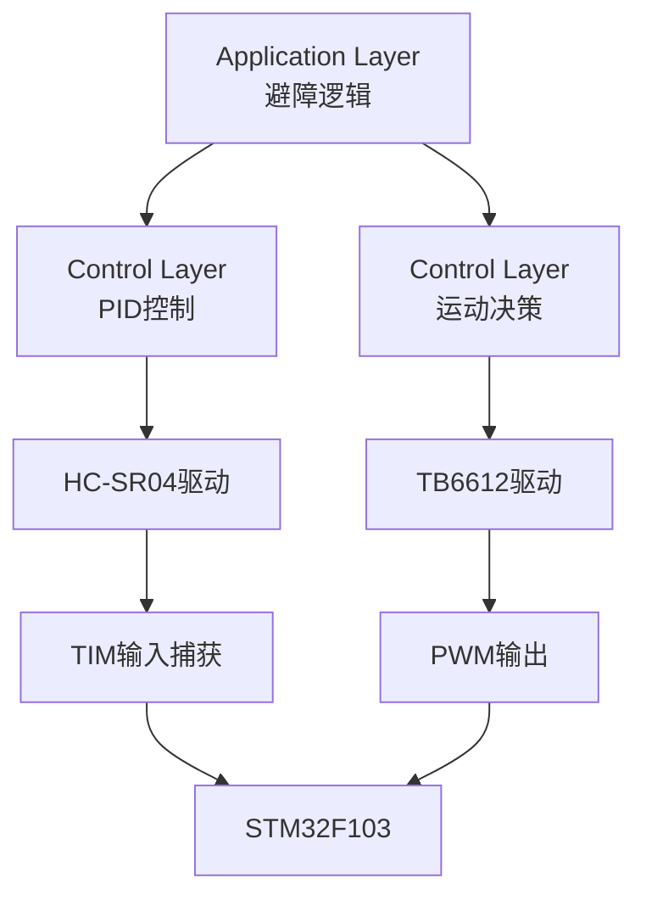

# -stm32f103C8T6-PCB-
这是一款基于stm32f103C8T6开发的智能避障小车，当超声波测得距离少于一定值时舵机转动，带着超声波测量四周距离，最后决定往哪走
系统架构图：

软件流程图：
开始
 │
 ▼
超声波测距
 │
 ▼
距离 < 阈值 ?
 ├─否──►继续前进
 │
 └─是
      │
      ▼
    停车
      │
      ▼
   右转避障
      │
      ▼
   继续测距

 工程目录结构
   Project
│
├─APP
│   ├─APP_ActionControl.c
│   ├─APP_Avoidance.c
│
├─Driver
│   ├─HC_SR04.c
│   ├─TB6612.c
│   ├─PID.c
│
├─BSP
│   ├─TIM.c
│   ├─GPIO.c
│
└─USER
    └─main.c
